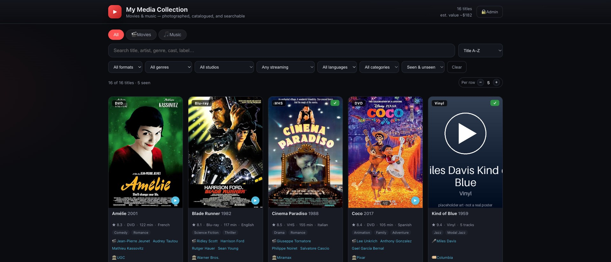

# 🎬 MediaHound

[](https://github.com/jchirayath/mediahound/actions/workflows/ci.yml)
[](https://github.com/jchirayath/mediahound/actions/workflows/codeql.yml)
[](LICENSE)
[](https://www.python.org/)
[](https://jchirayath.github.io/mediahound/)

**Turn photos of your DVD / VHS / Blu-ray collection into a sleek, searchable web catalog.**

Point MediaHound at a folder of cover photos. It identifies each movie, pulls in poster art,
genres, cast, studio, runtime and ratings, writes a short enticing intro, estimates the used
resale value, checks where it's streaming, and generates a polished static website you can
search, filter, sort, and curate — with a password-protected admin mode.

**▶ [Live demo](https://jchirayath.github.io/mediahound/)** — explore a sample catalog in your browser (admin password: `changeme`).

[](https://jchirayath.github.io/mediahound/)

> ℹ️ The demo shows **real movie posters** (hotlinked from IMDb/OMDb for illustration) so you can
> see what a finished catalog looks like — no poster images are stored in this repo. The extra
> gallery photos are generated placeholders standing in for *your own* cover photos. Your real
> catalog pulls poster art from TMDB / OMDb / Wikidata, or falls back to the photos you take.

- **Runs for anybody with zero API keys** — open-source OCR + open data by default.
- **Offline-first** — never contacts the internet unless you explicitly ask (`--online`).
- **Static output** — deploy anywhere (Netlify, GitHub Pages, S3, Vercel) or just open the HTML file.
- **No secrets in the repo** — keys live in a gitignored `.env`; your catalog is generated output.

> MIT-licensed. Your photos, keys and catalog never get committed to this tool's repo.

---

## See it in 30 seconds (no photos, no keys)

```bash
git clone https://github.com/jchirayath/mediahound && cd mediahound
pip install -e .

mediahound init demo
mediahound build --config demo/config.toml --mock   # generates a 10-title sample catalog
cd demo && python3 -m http.server 8000              # open http://localhost:8000
```

That's the screenshot above. Click **🔒 Admin** and sign in with **`changeme`** to try the
read/write admin tools. Everything you see is generated by `--mock` — no internet, no API keys.

> Once published to PyPI you can skip the clone and just `pip install mediahound` (then
> `mediahound init …`). Maintainers: see [RELEASING.md](RELEASING.md) for the one-time publish setup.

---

## Cataloguing your own collection

```bash
pip install -e ".[ocr]"     # adds the default OCR identifier
# Install the Tesseract engine for OCR:
#   macOS:  brew install tesseract
#   Debian: sudo apt-get install tesseract-ocr

mediahound init mysite                 # scaffolds mysite/ (RawImages/, config.toml, web template)
cp ~/Pictures/covers/*.jpg mysite/RawImages/
mediahound build --config mysite/config.toml --online   # identify + enrich (see Providers below)
cd mysite && python3 -m http.server 8000
```

Add more photos to `RawImages/` anytime and re-run `build` — only the **new** ones are processed
(state is tracked by content hash in `data/manifest.json`).

---

## Features

### The catalog
- **Search** title / genre / cast / studio / intro, **sort** by title, year, recently-added, value or rating.
- **Filters**: format, genre, studio, **streaming service**, language, category, seen / unseen.
- **Dense, aligned cards** showing poster, title·year, ★rating · format · runtime · language,
  genres, director + cast, studio, where-to-watch, intro hook, and estimated resale value.
- **Clickable everything**: a genre, person, or studio filters the grid to matching titles.
- **Adjustable density** — viewers pick how many movies per row; responsive on web & mobile.

### Photos
- **Multi-photo galleries** — flip through every photo of a title with ‹ › arrows.
- **Click-to-zoom** lightbox; set any photo as the default; rotate photos (baked in on rebuild).
- Auto-uprights sideways/landscape cover photos to portrait.

### Where to watch & resale
- **Where to watch** — is it on Netflix / Amazon Prime / Hulu? A clickable ▶ badge + pills link
  straight to the title (via JustWatch, no key). A filter narrows to a specific service.
- **Resale value** — a heuristic estimate plus a live link to eBay sold/completed listings.

### Two views
- **Default view** — public, read-only.
- **Admin view** — password-protected, read/write. Edit a title's name, year, format, studio &
  distributor; mark seen; rotate / set-default / delete a photo; delete a title; and configure
  the **library name, description, logo, which fields are shown, and default columns**.
- All edits are saved in the browser and **exported as small JSON files** (`corrections.json`,
  `seen-overrides.json`, `view-config.json`) that you drop into `data/` and rebuild to persist.

### Manual identification
- Covers that couldn't be read are grouped on `identify.html`, where you **name** them (queued for
  discovery on the next online build) or **discard** them (e.g. blank tapes).

---

## How it compares

Most movie-collection tools add items by **barcode scan or manual entry** and keep your catalog in
**their cloud** or a dated desktop app. MediaHound is the only one that identifies titles from
**photos of the covers** and generates a **modern static website you own and host for free** —
offline-first and open-source. It's also one of the few that handles **VHS** (which usually has no
scannable barcode in the disc databases others rely on).

| | MediaHound | CLZ / Libib | Tellico / GCstar | Plex / Jellyfin |
|---|---|---|---|---|
| Add by **photo of cover** | ✅ OCR/AI | ❌ barcode/manual | ❌ search/manual | ❌ scans video files |
| Modern **website you host free** | ✅ | ❌ their cloud | ◻︎ dated HTML export | ❌ private server |
| Open-source / offline / no account | ✅ | ❌ | ✅ desktop | ✅ (Jellyfin) |
| For a **physical** shelf | ✅ | ✅ | ✅ | ❌ digital files |

See **[COMPARISON.md](COMPARISON.md)** for the full, honest analysis — including when a barcode app
(CLZ/Libib), an OSS desktop cataloger (Tellico/Data Crow), or a media server (Plex/Jellyfin) is the
better choice.

---

## Providers (how titles get identified & enriched)

Both paths are first-class — pick them per-site in `config.toml`. The default needs **zero keys**.

| Concern | Default (no key) | Optional upgrade |
|---|---|---|
| **Identify** title from a cover | `tesseract` — open-source OCR | `claude` (Anthropic vision, also writes the intro) · `ollama` (local model) |
| **Metadata** + poster | `wikidata` — Wikidata + Wikipedia + Wikimedia | `tmdb` (free key) · `omdb` (free key) |
| **Where to watch** | `justwatch` — no key | — |
| **Resale** | eBay sold-listings link + estimate | — |

Switch to a premium provider in `config.toml`:

```toml
[identify]
provider = "claude"      # needs ANTHROPIC_API_KEY
[metadata]
provider = "tmdb"        # needs TMDB_API_KEY (or use "omdb" + OMDB_API_KEY)
```

…and create a **gitignored** `.env` next to `config.toml`:

```
ANTHROPIC_API_KEY=sk-ant-...
TMDB_API_KEY=...
```

Robustness built in: results are cached (`data/.metadata-cache.json`) so rebuilds never re-hit a
rate-limited free key, providers fail soft (a bad lookup never drops a title), and a fuzzy match
that returns the wrong film is rejected so it can't corrupt your names.

---

## Offline by default

`mediahound build` is **offline** — it regenerates the site from existing data and never contacts
the internet. Add `--online` to allow identification / metadata / where-to-watch lookups:

```bash
mediahound build --config mysite/config.toml              # offline: just rebuild the site
mediahound build --config mysite/config.toml --online     # online: identify + enrich new titles
mediahound build --config mysite/config.toml --online --refresh-streaming   # also re-check where-to-watch
```

Useful flags: `--mock` (demo data), `--force` (reprocess everything), `--limit N`, `--reidentify <sha256>`.

---

## Deploy

The generated site folder (`mysite/`) is plain static files (`index.html`, `identify.html`,
`assets/`, `data/`, `posters/`, `originals/`). It's just static files, so you can **host it free**
on **GitHub Pages, Cloudflare Pages, Netlify, Vercel, Render, or Surge.sh** — no server, database,
or build step required. Quickest:

```bash
cd mysite && npx netlify deploy --prod          # Netlify
cd mysite && npx wrangler pages deploy .         # Cloudflare Pages
cd mysite && npx surge .                         # Surge.sh
```

See **[DEPLOYMENT.md](DEPLOYMENT.md)** for the full free-hosting comparison plus GitHub Pages, Vercel
and S3 instructions. The live demo above is itself hosted free on GitHub Pages via a workflow.

It even works by **double-clicking `index.html`** — the build embeds the catalog in `data/bundle.js`
so it loads without a web server.

---

## Architecture

See **[ARCHITECTURE.md](ARCHITECTURE.md)** for the full picture. In short:

```
RawImages/*.jpg ─▶ identify (OCR / vision) ─▶ enrich (poster, genres, cast, studio, rating)
                                                    │
                          confidence too low? ──────┴─▶ data/unidentified.json → identify.html
                                                    ▼
   + intro + resale + where-to-watch ─▶ data/collection.json ─▶ static site (index.html)
```

Python CLI (`mediahound/`) builds the data; a dependency-free vanilla-JS frontend (`mediahound/web/`) renders it.

---

## Attribution & licensing

- Code: **MIT** (see [LICENSE](LICENSE)).
- Default data: **Wikidata** (CC0), **Wikipedia** text (CC BY-SA), images via **Wikimedia Commons**.
- If you enable **TMDB**: uses the TMDB API but is not endorsed or certified by TMDB.
- Where-to-watch data via **JustWatch**; resale links to **eBay** sold listings (estimates are heuristics).

## Security

MediaHound output is a **static site** — read-only to everyone, with no server to attack. The admin
password is a convenience gate, **not** an access-control boundary (the published catalog can't be
changed without rebuilding + redeploying). API keys stay in a gitignored `.env`; only the password
hash ships. All rendered data is HTML-escaped and links are scheme-restricted. See
**[SECURITY.md](SECURITY.md)** for the full threat model and reporting instructions.

Contributions welcome — see [CONTRIBUTING.md](CONTRIBUTING.md).
